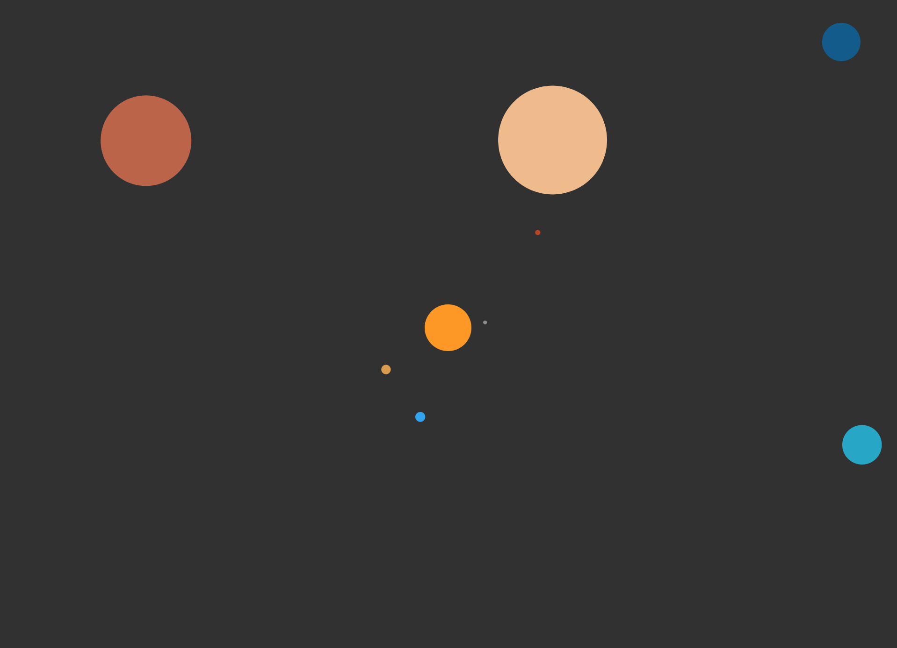

# p5.js Solar System Illustration
*Solar System Illustration using p5.js*



This repository uses the p5.js package in JavaScript to create an illustration of the plantes in our solar system. Note that this is not a simulation, but an illustration. Meaning the planet's orbits are not based on orbital mechanics, but rather circular motions rendered at speeds that replicate the avarege speed of the real planet's orbits but speed up a lot, i.e. the plantes' orbits are somewhat realistic relative to each other. 

Also, the size of the planets are to scale, however, the sun is not at all to scale. This decision was made because the sun is supermassive compared to the other planets, which would render them almost invisible. 

The planet's orbits are not to scale either, however, some code could be commented out in order to make the orbits more realistic, however, that does result in either only the inner four planets being visible, or these planets being really really tiny (by tweacking some scaling parameters in the code). So, to illustrate the solar system, hereby the relative size and relative speed of the plantes, the orbital radiuses are not realistic. 

## How was this p5.js sketch made? 
This is really a very simple program that was created on the second day after I first started programming in p5.js (although I had some previous JavaScript experience). The key element to make this program work is to program the circular orbits. The parametric equation of a circle is crucial to this program (this page explains it well: https://www.mathopenref.com/coordparamcircle.html). The equation describes all the points on a circle given the circle's *radius, r* and the chosen *radian* on the circle, as well as the *origin* (x, y)of the circle. A radian is simply an alternative to using degrees to describe areas of the the circle. The parametric equation of a circle takes radians as input, but degrees can easially be converted to radians using this JavaScript function: 

```javascript
function deg_to_rad(degrees) {
	return (degrees - 90 )* PI / 180;
}
```
The parametric equation of a circle, that I have been rambling on about, looks like this:
**x = r cos(t)**
**y = r sin(t)**
Where r is the radius, and t is the radian describing the point on the circle. This simple piece of math is incorporated into the program using the following code: 
```javascript
function points_on_circle(cx, cy, r, a) {
	let x = cx + r * cos(deg_to_rad(a));
	let y = cy + r * sin(deg_to_rad(a));
	return [x, y];
}
```
In this function cx and cy are the coordinates of the center of the solar system, r is the radius of an orbit and a is the degree on the circle at which the planet is in the current frame. When we have this key function the following function incorporates the previous function in order to render a planet using the **ellipse** function of the p5.js library: 
```javascript
function planet(center_of_screen_x, center_of_screen_y, diameter, orbit_radius, starting_point, year) {
	coordinates = points_on_circle(center_of_screen_x, center_of_screen_y, orbit_radius, year-starting_point);
	ellipse(coordinates[0], coordinates[1], diameter, diameter);
}
```
The final important part of this program is how we assign the degrees of the planets to the function above, that is what we put in as the **year** argument. In order to do this I add *360*/*the days of the planets orbit in earth days* times a *scaling factor*. This makes the planets that have few days in a year move relatively many degrees in a frame, and planets that have longer orbits move fewer degrees in a frame. The current degree of the planets is stored in a dictionary called *is* (stems from the fact that the first program only had one planet and looped based on the current state of a loop which normally is denoted as *i*). At the start of the main loop *draw* a function checks if some of the planets have reach more than 360 degrees, and is reset to 0 using the following function that loops through each element of the dictionary that stores the degrees of each planet:
```javascript
for (var this_planet in is) {
	if (is[this_planet] > 360) {
		is[this_planet] = 0;
	}
}

```
That is pretty much it! To run this program I am using the node.js program called live-server. When installed using **npm** simply navigate into the folder of where the two files in this repository is located and run **live-server**. 


